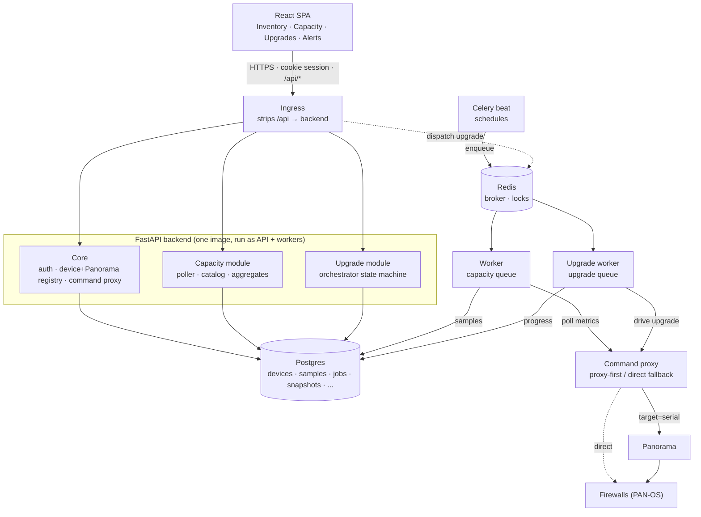
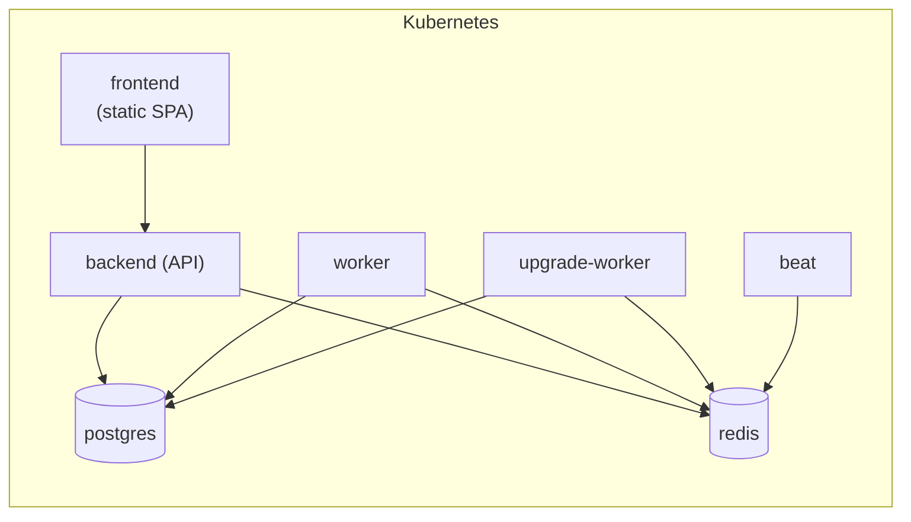

# Architecture

PAN NGFW Ops Console — an operations console for Palo Alto Networks firewalls.
Two product modules sit on a shared core:

- **Capacity Analyzer** — polls firewalls on a schedule, stores time-series of
  resource usage vs. each platform's max, and visualizes headroom.
- **Upgrade orchestration** — drives PAN-OS upgrades (single device or HA pair)
  through prechecks → snapshots → download → install → reboot → postchecks, with
  operator gates and HA safety belts.

Both read the **same device inventory** and reach firewalls through the **same
command proxy**, so a device added once is available to every module.

---

## Tech stack

| Layer | Tech |
|---|---|
| Frontend | React 18 + TypeScript, Vite, @tanstack/react-query 5, react-router 6, Tailwind, recharts |
| Backend | FastAPI, SQLAlchemy 2.0, Pydantic v2 (Python 3.11) |
| Async | Celery (beat + workers), Redis (broker + coordination) |
| Storage | PostgreSQL (prod) / SQLite (tests), Alembic migrations |
| Device I/O | pan-os-python (XML API), panos-upgrade-assurance (readiness checks, snapshots, diffs) |
| Auth | Cookie sessions, Argon2id passwords, TOTP 2FA, OIDC (authlib) |
| Crypto | Fernet — credentials encrypted at rest (`FERNET_KEY`) |

---

## High-level map



Two distinct flows share the plumbing:

- **Capacity poll loop** — beat → Redis → capacity worker → command proxy → device → `samples` table → aggregates → SPA.
- **Upgrade drive loop** — SPA creates a job → API dispatches to Redis → upgrade worker runs the orchestrator → command proxy → device → progress persisted to `device_upgrade_tasks` → SPA polls.

---

## Code layout

The backend is a shared `core/` plus one feature module per area of operations.
**Import boundary:** a feature module (`capacity/`, `upgrade/`) may import from
`core/*`, but `core/*` must never import from a feature module.

```
backend/app/
├── core/                     shared platform code
│   ├── auth/                 users, sessions, OIDC, TOTP, FastAPI deps
│   ├── devices/              Device model + routes + services (ha, rma)
│   ├── panorama/             Panorama model, client, sync + routes
│   ├── command_proxy/        pan-os client (proxy-first, direct-fallback)
│   ├── credentials.py        Fernet-encrypted credential helpers (audit chokepoint)
│   ├── crypto.py             Fernet wrappers
│   └── concurrency.py        Redis dispatch locks + per-Panorama semaphores
├── capacity/                 polling, catalog, time-series, aggregates
│   ├── models/{sample,polling_config}.py
│   ├── services/{poller,catalog,storage,polling_config}.py
│   ├── tasks/                Celery: dispatch_due, poll_device_task, poll_all
│   └── routes/{metrics,aggregates}.py
├── upgrade/                  the orchestrator + supporting services
│   ├── models/{job,snapshot,precheck,image,stage,enums}.py
│   ├── services/{upgrade,precheck,precheck_classifier,snapshot,disk_cleanup}.py
│   ├── tasks/                Celery: drive_pair_task
│   └── routes/{jobs,images,precheck_sets,snapshots,software,disk}.py
├── workers/celery_app.py     Celery app + beat schedule + queue routing
├── main.py                   FastAPI app, lifespan (runs migrations), routers
├── config.py                 env-var settings
└── db.py                     dialect-aware engine + session factory
```

The frontend mirrors the split: `frontend/src/{core,capacity,upgrade,alerts}/`
plus `api.ts` (the cross-module typed client) and `App.tsx` (routing root).

---

## Runtime processes

The backend is **one image** run in several roles; the frontend is a separate static-served image.

| Process | Role |
|---|---|
| `backend` (API) | FastAPI HTTP server. On startup, lifespan runs `alembic upgrade head`, then mounts routers. |
| `worker` (capacity queue) | Executes scheduled capacity polls. |
| `upgrade-worker` (upgrade queue) | Executes the upgrade orchestrator (long-running, isolated queue). |
| `beat` | Emits the periodic schedule into Redis. |
| `postgres` | System of record. |
| `redis` | Celery broker/result backend **and** coordination primitives (dispatch locks, per-Panorama semaphores). |
| `frontend` | Static SPA served behind the ingress; calls the API same-origin at `/api/*`. |

**Beat schedule** (`workers/celery_app.py`):
- `capacity.dispatch_due` every ~30s — enqueues per-device polls that are due.
- `panorama.sync_all` every ~300s — refreshes inventory from each Panorama.
- `capacity.poll_all` exists but is **not** scheduled — it's the manual "Poll now" button.
- `upgrade.*` tasks are **dispatch-on-demand** (no schedule) and routed to a dedicated `upgrade` queue; Redis `visibility_timeout` is set longer than the task's hard time limit so a long upgrade isn't redelivered mid-run.

---

## Request & auth flow

All routers except `auth` are mounted behind `Depends(current_user)` (`main.py`), so every non-auth endpoint requires a valid session; user/provider admin routes add `current_admin`.

- **Sessions** (`core/auth/services/sessions.py`) — a random token is set as the `pcasession` cookie; only its SHA-256 hash is stored. `lookup_session` hashes the incoming cookie, checks expiry + that the user is active, and bumps `last_seen_at` (sliding *staleness*, not sliding expiry).
- **Login** (`core/auth/routes/auth.py::login`) — rate-limited per (IP, username); Argon2id verify always runs (dummy hash for unknown users to avoid timing leaks); if TOTP is enabled, a second step consumes a TOTP code or a single-use backup code; password hashes are opportunistically re-hashed on login.
- **OIDC** (`core/auth/services/oidc.py`) — authlib with PKCE + nonce + state; the ID token is validated against the provider's JWKS. Identity resolution is **invite-only**: it matches a durable `(provider, sub)` binding first, else links a *pre-existing* local user by verified email (or asserted email/UPN only for a `trusted_identity` provider). It never auto-creates users, and refuses to re-point an already-linked account (UPN-reuse/takeover guard).

---

## Shared core

### Device + Panorama registry — unified inventory

`core/devices/` and `core/panorama/` own the single `devices` + `panoramas` tables that both modules read. There is no parallel registry: a device added once is visible to capacity polling and upgrade jobs alike.

- **Two entry paths, one table** — manual `POST /devices` (creates a `DIRECT` device with its own encrypted key) or Panorama sync (creates `PANORAMA` devices, proxy-on by default). Proxy is **opt-out**: a Panorama-linked device defaults to being managed through that Panorama.
- **Panorama sync** (`core/panorama/services/sync.py::sync_panorama`) — pulls managed devices, builds an `existing` map **keyed by serial**, and for each managed device either inserts it or refreshes it *without* clobbering an operator's explicit `proxy_via_panorama=False`. After flush it **re-resolves HA peers** via a serial→device map, nulling links whose peer isn't managed. A `serial_filter` lets the operator sync a subset without deleting the rest.
- **HA pairing** — `Device.ha_peer_id` is a self-referential FK (`post_update=True` to break the insert cycle). `core/devices/services/ha.py::map_ha_role` collapses raw Panorama HA strings into the orchestrator's 4-state `HARole`.

**FK graph hanging off a device** — `samples`, `snapshots`, `precheck_runs`,
`device_stage_runs`, `alerts`, and `device_upgrade_tasks` all reference
`devices.id` with **ON DELETE CASCADE** (so deleting a device removes its
history). The self-referential `ha_peer_id` is **NO ACTION**, so deletes and RMA
swaps release peers explicitly. Key device-lifecycle logic:

- **`delete_device`** (`routes/devices.py`) — releases any HA peer pointing at
  the device (the self-FK won't cascade), deletes (children cascade), and wraps
  the commit so any residual integrity error surfaces as a clear **409** instead
  of a silent 500.
- **`replace_serial`** (`services/rma.py`) — RMA hardware swap. Re-points the
  existing record to a new serial: copies the replacement box's runtime/hardware
  fields off the auto-imported duplicate, re-points the duplicate's child rows
  (so its history survives instead of cascade-deleting), removes the duplicate,
  then assigns the new serial and clears the stored key (new hardware needs fresh
  auth). The kept record now owns the serial, so the next sync dedupes onto it.

### Command proxy — proxy-first, direct fallback

`core/command_proxy/` is the single path to every firewall.

- **Client selection** (`builder.py::build_client_with_fallback`) — if the device
  is proxy-eligible (`proxy_via_panorama && panorama_id && serial`), build a
  Panorama-proxied client and probe it with a cheap `get_system_info()`:
  - success → mark the Panorama healthy, use the proxy;
  - `TargetDisconnectedError` → the Panorama answered, so it stays **healthy**
    (the *device* is down) and we try direct if the device can — this avoids one
    offline device flapping the shared Panorama's reachability flag;
  - any other error → mark the Panorama unhealthy and fall back to direct.
- **Transient retry** (`pan_client.py::retry_on_transient`) — wraps **read-only**
  ops only; retries 3× on a fixed backoff for transient markers (timeouts,
  connection reset/aborted, remote-disconnected, target-disconnected, temporarily
  unavailable) but re-raises permanent errors (connection refused, DNS, auth)
  immediately.
- **Friendly errors** (`pan_client.py::_friendly_check_error`) — classifies raw
  exceptions into actionable hints, notably distinguishing *our* TLS handshake to
  the device (fixable via `verify_tls=false`) from the *firewall's* outbound TLS
  to update servers (not fixable that way), and read-timeout (slow mgmt plane) vs
  connect-timeout (unreachable).
- **Credentials** (`core/credentials.py` → `core/crypto.py`) — every key decrypt
  funnels through one audit-logged chokepoint; keys are encrypted at rest with
  Fernet (`FERNET_KEY`). Proxied calls decrypt the *Panorama's* key and route via
  `target=serial`; direct calls decrypt the *device's* key.

---

## Capacity Analyzer module

`backend/app/capacity/`

| File | Role |
|---|---|
| `services/poller.py` | Poll engine: per-device metric extraction, per-command response caching, unreachable detection. |
| `tasks/__init__.py` | Celery tasks: `dispatch_due` (staggered dispatcher), `poll_device_task`, `poll_all`. |
| `services/catalog.py` | Loads/validates `metrics.yaml` into typed `MetricSpec`; holds the XML extractors. |
| `services/storage.py` | `SampleStore` protocol + `SQLAlchemySampleStore` → the `samples` table. |
| `services/polling_config.py` | Operator-editable runtime cadences/concurrency (singleton row). |
| `routes/metrics.py`, `routes/aggregates.py` | Series + catalog + poll-now; heatmap/table/trend. |

**Flow.** Beat fires `dispatch_due`; it selects `polling_enabled` devices, decides
which of two metric **classes** are due per device (a fast *system* cadence and a
slow *config* cadence), groups by managing Panorama, and fair-share round-robins
one poll enqueue per group per pass — bounded by a per-Panorama Redis semaphore so
one Panorama isn't hammered. Each `poll_device_task` builds a client
(proxy/direct), runs each metric's catalog command via `op_xml`, extracts a
`current` (and optional `max`) with `pct = current/max·100`, and writes `Sample`
rows. Aggregates read back via a "latest sample per (device, metric)"
`ROW_NUMBER` query joined to `devices`; a sample older than a few poll intervals
is flagged **stale** and dropped from the heat-map's color, so a device that
stopped reporting can't keep a tile lit with a frozen value.

**The catalog.** Each metric in `catalog/metrics.yaml` is a `(current, max)` pair
of fetchers; `current` can sum multiple `sources` (so e.g. Panorama-pushed +
locally-configured object counts combine automatically):

```yaml
- name: address_objects
  category: config
  current:
    sources:
      - cmd: "<show><config><pushed-shared-policy/></config></show>"
        extract: { type: xpath_count, xpath: ".//address/entry" }
      - cmd: "<show><config><running/></config></show>"
        extract: { type: xpath_count, xpath: ".//vsys/entry/address/entry" }
  max:
    cmd: "<show><system><state><filter>cfg.general.max-address</filter></state></system></show>"
    extract: { type: state_value, key: cfg.general.max-address }
```

Extractor types: `xpath_count`, `xpath_text`, `xpath_avg`, `xpath_max`,
`state_value`, `text_regex` (with optional `invert` for "100 − value" cases like
CPU idle). `xpath_avg`/`xpath_max` roll a set of matches (e.g. per-DP CPU cores)
into one number.
Adding a metric is usually a YAML edit, not code. The poller caches `op()`
responses across metrics that share a command, so N metrics ≠ N round-trips.

**Key logic**
- `dispatch_due` — per-class due selection + fair-share round-robin; optimistically
  stamps the per-class timestamp so a device isn't re-selected while its poll is
  in flight.
- `poll_device_task` — on success stamps the class timestamp + `last_poll_at`; on
  failure **rewinds** the timestamp by `interval − backoff` so it retries in ~60s
  instead of waiting a full interval; always releases its Panorama slot in
  `finally`.
- `poll_device` — lazy-heals the device `model` on first poll; raises "unreachable"
  only if *every* command failed, so a down device isn't recorded as a successful
  zero-sample poll.
- `_predict_max_date` (aggregates) — least-squares linear regression on
  (days, value); returns `insufficient_data` / `decreasing` honestly, else
  `days_left = (max − current) / slope`.
- `try_acquire_slot` (`core/concurrency.py`) — atomic (Lua) prune-stale +
  cap-check + add-token semaphore that self-heals slots leaked by crashed tasks.

---

## Upgrade orchestration module

`backend/app/upgrade/` — the largest subsystem. The orchestrator
(`services/upgrade.py`) is a **non-blocking, HA-aware state machine**.

| File | Role |
|---|---|
| `services/upgrade.py` | The orchestrator: drives a standalone device or HA pair through all phases. |
| `services/precheck.py` | `probe_device` (refresh + link HA peer) + `run_precheck_for_device`. |
| `services/precheck_classifier.py` | Maps raw readiness results into a 4-state severity (some checks downgraded to WARN). |
| `services/snapshot.py` | `capture` (persist a state snapshot) + `compare` (per-area diff). |
| `services/disk_cleanup.py` | Dry-run plan + execute; the server recomputes the safe-to-delete set (never trusts the client). |
| `tasks/__init__.py` | Celery `drive_pair_task` (acks-late, reject-on-worker-lost, soft/hard time limits). |
| `routes/jobs.py` | Job + task HTTP surface (create/start/abort/delete, confirm/override/rerun/retry). |
| `models/job.py` | `UpgradeJob` + `DeviceUpgradeTask` (its `progress` JSON column is load-bearing). |

**Flow.** `POST /upgrade/jobs` creates a job (PENDING) with one
`DeviceUpgradeTask` per device, deriving an `ha_pair_key` so peers share a key.
`POST .../start` flips to RUNNING, commits, then dispatches one
`drive_pair_task` per unique pair key. Each task runs `drive_pair` under a
per-pair Redis **dispatch lock** (duplicate dispatch is a no-op), reconciles
persisted markers against live device state, and routes to `_drive_solo` or
`_drive_ha_pair`. The orchestrator walks phases imperatively, persisting
everything (log, completed-phase markers, substep, PAN-OS job ids, percentages)
to `task.progress`. The job goes terminal only when every task is done —
`_maybe_mark_job_done` resolves to COMPLETED / COMPLETED_WITH_ERRORS / FAILED, so
one device failing doesn't sink the others (failure isolation).

### The non-blocking wait pattern (the heart of it)

A PAN-OS install or reboot takes many minutes. Rather than block a worker for the
whole time, the orchestrator uses **issue-once / poll-on-re-entry / re-dispatch**:

- **`_await_or_park`** — persists a start clock on first entry, calls `is_done()`
  exactly once, then returns one of:
  - **DONE** — proceed;
  - **TIMED_OUT** — the persisted clock elapsed → fail the step with an accurate
    message;
  - **PARKED** — not done yet → re-dispatch `drive_pair_task` after a short
    `countdown`, return control, and free the worker slot.

  So a long wait is a series of cheap re-entries, not a held worker. The same
  shape powers **`_confirm_gate`** (operator confirm/override): if the gate isn't
  satisfied it parks at an `AWAITING_*` phase; the route sets a
  `confirmation_token` and re-dispatches to resume.

### Per-step logic (fail-fast, idempotent)

Each step is guarded by a marker so re-entry never repeats a side effect:

- **`_download_step`** — per image slot (base / target), issue the download once,
  then poll; short-circuits on `is_version_downloaded`; runs a catalog "Check Now"
  first; surfaces PAN-OS's real failure `details` rather than guessing "disk full".
- **`_install_step`** — issue `request software install` once; poll the job to FIN.
  **FIN ≠ success** — a non-OK result fails fast **without rebooting**; an
  install job that vanishes for several polls (device crashed mid-install) also
  fails fast.
- **`_reboot_step`** — issue the restart once (never re-restart); require several
  *consecutive* healthy readiness ticks; track downtime + version so it fails fast
  if the box reboots onto the **old** image instead of waiting out the timeout.
- **`_passive_step`** — single-shot HA-state check per re-dispatch until the
  member reports `passive` / `active-secondary`.

### HA safety belts

- **`_drive_ha_pair`** serializes the pair: classify which member upgrades first,
  precheck + snapshot both, ensure the image, then **suspend → install →
  postcheck → snapshot** the passive, **`_phase_failover`**, optional operator
  gate, then the former-active.
- **`_classify_pair`** persists the chosen first-mover on `progress["ha_member"]`
  so re-entry is role-stable (a mid-upgrade box reports `ha_role = unknown`).
- **`_phase_failover`** refuses to suspend the active member unless the upgraded
  peer is in a take-over-capable state — preventing a both-nodes-down outage.
- **`_heal_suspended_members` / `_resume_suspended_member`** — on any failed or
  aborted pair, resume any member we suspended (acting on the `suspend_ha` marker
  *or* live `suspended` state) and verify it took effect, so the orchestrator
  never leaves a cluster single-noded.
- **`reconcile_markers_with_device_state`** — on entry, probe live state and
  set/clear `install_complete` / `ha_resume_complete` / `suspend_ha` markers so
  Retry and Celery redelivery resume correctly even when persisted markers lie.

### Prechecks & snapshots

- **`run_precheck_for_device`** builds a client, probes, runs
  panos-upgrade-assurance readiness checks, and classifies them.
  `precheck_classifier.py` downgrades some checks (e.g. free-disk, content
  version) to WARN so they prompt rather than hard-block.
- **`snapshot.capture`** persists a state snapshot; **`snapshot.compare`** diffs
  pre vs post **one area at a time**, so an un-comparable area (e.g. routes on a
  device in Advanced Routing Mode) is skipped and recorded under `_skipped`
  instead of sinking the whole diff. `session_stats` is captured but excluded from
  the comparison (counters legitimately reset across reboot).

---

## Frontend

`frontend/src/` — a React SPA. `api.ts` is a single typed client: every call is
`"/api" + path` with `credentials: "include"` (cookie auth); the `j()` helper
throws `ApiError(status, detail)` on non-OK so mutations can surface the backend's
message. App-wide react-query defaults are `staleTime: 30s`,
`refetchOnWindowFocus: false`; pages override polling as needed.

| Page | Endpoints | Notable client logic |
|---|---|---|
| `HomeDashboard` | `/upgrade/jobs/summary`, `/devices/version-distribution`, `/devices`, `/panoramas` | Four 30s-polling triage frames. |
| `capacity/CapacityAnalyzer` → `CapacityTable` → `CapacityTrend` | `/capacity/{heatmap,table,trend}` | Heat-map (model × metric); filters persisted in URL params; drill-down chain. |
| `core/devices/Inventory` | `/devices`, `/panoramas` (+ sync/preview/test/test-connection) | HA-pair grouping (select one → selects the peer); row action menu (Test / Edit / Disk cleanup / **Replace serial** / Delete); hands a selection to job creation. |
| `upgrade/UpgradeJobs`, `JobDetail` | `/upgrade/jobs[/id]`, `/upgrade/tasks/{id}/{confirm,override,rerun-check,retry}` | `JobDetail` polls every 3s (off when terminal), groups tasks by HA pair, phase-gates the action buttons, and renders snapshot diffs; substep gating avoids a stale "Rebooting %". |
| `alerts/AlertsPage` | `/alerts[/rules]` | Active alerts + rule management. |
| `core/auth/*` | `/auth/*`, `/users`, `/providers/oidc` | Two-stage login (password → TOTP) + OIDC; first-user bootstrap; self-service profile; admin user/provider management. |

Build/serve: the Vite dev server proxies `/api` to the backend; the production
image builds same-origin (`VITE_API_BASE_URL=""`) and is served as static files
behind the ingress, which strips the `/api` prefix before forwarding to the
backend's unprefixed routes.

---

## Data model & persistence

PostgreSQL in production, SQLite in tests (with `PRAGMA foreign_keys=ON` so FK
behavior matches). Schema is managed by **Alembic**; the API runs
`alembic upgrade head` on startup. Engine config is dialect-aware (`db.py`):
SQLite gets `check_same_thread=False`; Postgres gets a connection pool with
`pool_pre_ping`. SQLAlchemy enum columns use a helper (`py_enum_column`) so the
ORM speaks each enum's wire value, matching what the migrations create.

Core tables: `devices`, `panoramas`, `users` / `sessions` / `backup_codes` /
`oidc_providers`; capacity: `samples`, `polling_config`; upgrade: `upgrade_jobs`,
`device_upgrade_tasks`, `snapshots`, `snapshot_diffs`, `precheck_runs`,
`precheck_sets`, `panos_images`, `bulk_stage_runs`, `device_stage_runs`; plus
`alerts` / alert rules.

---

## Deployment (generic)

The app is containerized and deployed to Kubernetes: the backend image runs as the
API plus the Celery worker / upgrade-worker / beat roles, alongside Postgres and
Redis, with the frontend served behind an ingress that terminates TLS and routes
`/api/*` to the backend. Example manifests live in
[`deploy/kubernetes/`](../deploy/kubernetes/) (Traefik with a `stripPrefix`
middleware on `/api`); see [`DEPLOYMENT.md`](DEPLOYMENT.md). Images are built and
published by CI. Operational specifics (hostnames, secrets, cluster layout) are
intentionally kept out of this repo.

